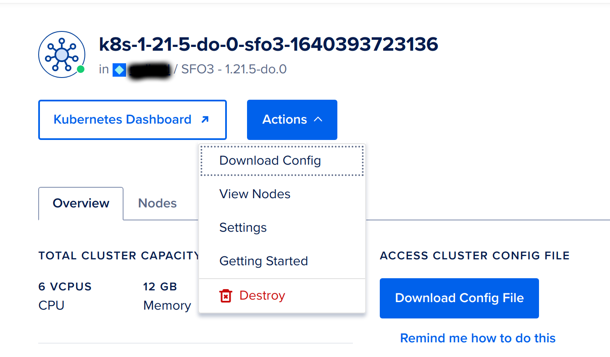
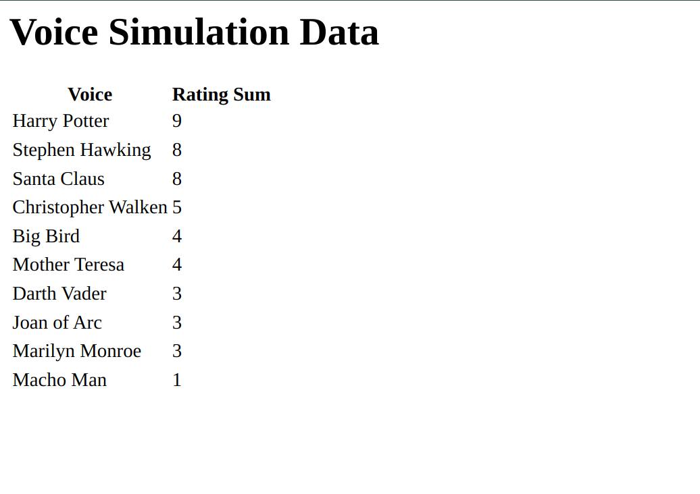

# DigitalOceanChallenge2021
## Part 1: Overview ##
This repository is the result of my attempt at the 2021 Digital Ocean Challenge objective.  Although it accomplishes the goal of deploying a scalable message queue, I hope it will spark interest in using GitOps tools as part of a development workflow, as they aid in the portability of, if nothing else, the working examples we want to discuss.

Everything is more fun when there's a story attached to it, so here's ours for this project. It came about, as the result of sitting around the dinner table talking over absurd ideas with my wife, T, who came up with the root idea on the spot, and we just expanded it to suit the need.

*Our company, Conglombo Corp Limited, has a research team working on text to voice simulation.  They are currently testing the cadence and dexterity of their voices by having them perform various Epic Rap Battles of History. Researchers are watching the performances and rating them accordingly.  The ratings are being placed in a Kafka topic. Our goal is to take topics off of the queue and do some simple analysis of the data from the topic.*

The demo will consist of a couple of web services. One will pretend to be the researchers, putting ratings onto a Kafka topic. The other will pull ratings out of the topic and them sum up rating values of each of the voices.
We will develop locally to start.  I hope that by doing this first it'll help folks get over on any trepidation they may have doing cloud development. Once we have things working, we will deploy the whole design to Digital Ocean.  The tools referenced in this walk through:
* [Docker](https://www.docker.com/) all the pieces of this project will be containerized, and we will use a dockerhub account as a repository for the consumer and producer images.
* A [kind cluster](https://kind.sigs.k8s.io/) will be used for our local Kubernetes cluster
* [Fluxcd](https://github.com/fluxcd/flux2) is used to make setting up and maintaining the services we put in k8s easier. It's also a great way to sum up a whole system, albeit a demo in this case, and move it around with a minimum of fuss.
* [Helm](https://helm.sh/) is a nice wrapper for describing deployments to k8s and easier for humans to read. We're using it here to keep the yaml in the examples short and *hopefully* straight to the point.
* The [Strimzi Kafka Operator Helm Chart](https://strimzi.io/documentation/) is used because it's an easy way for us to get a workable message queue in place for Kubernetes. In a real world scenario, the business you'd be working with would probably already have one in place, so this is just filling that gap.
* Finally, we'll demonstrate how easy it is to migrate our setup into a [Digital Ocean]( https://cloud.digitalocean.com) k8s cluster!

There are a bunch of parts to this walk through. Here's an index if you want to jump to different parts:

[1. Overview](https://github.com/mdbdba/DigitalOceanChallenge2021#part-1-overview) Summarizes the goal and what tools we're using (you are here!)

[2. Kind Cluster and GitOps Setup](https://github.com/mdbdba/DigitalOceanChallenge2021#part-2-kind-cluster-and-gitops-setup) Goes through the creation of our local cluster and details out how to make flux live in it.

[3. Add Kafka Using GitOps](https://github.com/mdbdba/DigitalOceanChallenge2021#part-3-add-kafka-using-gitops) The Strimzi cluster operator and the cluster itself are deployed in this part.

[4. Testing Kafka](https://github.com/mdbdba/DigitalOceanChallenge2021#part-4-testing-kafka) With Kafka up and running, we kick the tires on it with a quick manual test.

[5. Kafka 50,000 Foot View](https://github.com/mdbdba/DigitalOceanChallenge2021#part-5-kafka-50000-foot-view) A few words about what Kafka is and the terminology we use with it.

[6. Make the Producer and Consumer](https://github.com/mdbdba/DigitalOceanChallenge2021#part-6-make-the-producer-and-consumer) Our example services that populate and pull from the Kafka topic

[7. Build the Images](https://github.com/mdbdba/DigitalOceanChallenge2021#part-7-build-the-images) With our code working, we take our code and builds our services into deployable images.

[8. Deploying the Example Services](https://github.com/mdbdba/DigitalOceanChallenge2021#part-8-deploying-the-example-services) Yeah, but how do those images make their way into our cluster?  This step explains how that works.

[9. Digital Ocean Deploy](https://github.com/mdbdba/DigitalOceanChallenge2021#part-9-digital-ocean-deploy) Now, with all the hard work done, we demonstrate how easy it is to move this work into a Digital Ocean k8s cluster.

## Part 2: Kind Cluster and GitOps Setup ##
To start this challenge we need a Kubernetes cluster.  I always start out designing on a kind cluster, so let's do that.
```shell
❯ kind create cluster --config=./cluster.yaml
Creating cluster "kind" ...
 ✓ Ensuring node image (kindest/node:v1.21.1) 🖼
 ✓ Preparing nodes 📦 📦 📦 📦  
 ✓ Writing configuration 📜 
 ✓ Starting control-plane 🕹️ 
 ✓ Installing CNI 🔌 
 ✓ Installing StorageClass 💾 
 ✓ Joining worker nodes 🚜 
Set kubectl context to "kind-kind"
You can now use your cluster with:

kubectl cluster-info --context kind-kind

Thanks for using kind! 😊
❯ k get nodes
NAME                 STATUS   ROLES                  AGE   VERSION
kind-control-plane   Ready    control-plane,master   16m   v1.21.1
kind-worker          Ready    <none>                 15m   v1.21.1
kind-worker2         Ready    <none>                 15m   v1.21.1
kind-worker3         Ready    <none>                 15m   v1.21.1


```
With a cluster up and running, we'll need something that will coordinate all the deployments and charts we want.  Let's use flux for that.

Flux, https://fluxcd.io/, has a bunch of functionality that you can explore.  We're just going to use it here to keep the resource management sane in this example. 

The requirements for flux are pretty straight forward.  You need:
* a github or gitlab repo of your own (it will use the repo to keep track of the config). I'm using the repo where this README lives as mine. You could fork this one if you like, or just point at an empty one you create. Either works.
* a Kubernetes cluster (like the one we just spun up), 
* and install/set up the cli. See the "Getting Started" doc, https://fluxcd.io/docs/get-started/, for how to do that. Make sure you define the environment variables that identify your GitHub/gitlab user and token, as explained in that doc. 

Just to be sure, verify that flux is installed and feels good about the cluster.
```shell
❯ flux --version
flux version 0.24.0
❯ flux check --pre
► checking prerequisites
✔ Kubernetes 1.21.1 >=1.19.0-0
✔ prerequisites checks passed
```
Now let's install and configure flux for our cluster.  The command to do that is "bootstrap".  The specific args to pass are:
* owner -- this is your github user
* repository -- this is the repository you want flux to use to keep track of things. If you've set the token privs right, it'll even create it for you if it does not already exist.
* branch -- This is the branch you want flux to use. I will use the default branch for the repo for this example.
* path -- Path within the repo where flux will place its management directory structure. 
* personal -- This tells flux that the repo owner is a GitHub user

Here's how I'm going to bootstrap my cluster:
```shell
❯ flux bootstrap github \
  --owner=$GITHUB_USER \
  --repository=DigitalOceanChallenge2021 \
  --branch=development \
  --path=./ops \
  --personal
► connecting to github.com
► cloning branch "development" from Git repository "https://github.com/mdbdba/DigitalOceanChallenge2021.git"
✔ cloned repository
► generating component manifests
✔ generated component manifests
✔ committed sync manifests to "development" ("e4e344ae7abefb2a7d6d0a032531ad8299bf3f8a")
► pushing component manifests to "https://github.com/mdbdba/DigitalOceanChallenge2021.git"
✔ installed components
✔ reconciled components
► determining if source secret "flux-system/flux-system" exists
► generating source secret
✔ public key: ecdsa-sha2-nistp384 AAAAE2Vj...
✔ configured deploy key "flux-system-development-flux-system-./ops" for "https://github.com/mdbdba/DigitalOceanChallenge2021"
► applying source secret "flux-system/flux-system"
✔ reconciled source secret
► generating sync manifests
✔ generated sync manifests
✔ committed sync manifests to "development" ("0343a43f460d1485d89bae8deef1d33eb50005e6")
► pushing sync manifests to "https://github.com/mdbdba/DigitalOceanChallenge2021.git"
► applying sync manifests
✔ reconciled sync configuration
◎ waiting for Kustomization "flux-system/flux-system" to be reconciled
✔ Kustomization reconciled successfully
► confirming components are healthy
✔ helm-controller: deployment ready
✔ kustomize-controller: deployment ready
✔ notification-controller: deployment ready
✔ source-controller: deployment ready
✔ all components are healthy

```
One of the CRDs that gets added with flux is kustomize.  We can verify that things are good so far by checking if any kustomizations exist.
```shell
❯ k get ks -n flux-system
NAME          READY   STATUS                                                                   AGE
flux-system   True    Applied revision: development/833451eac2d2ef566ea0c9a7f5906ab14b0a11fc   6m38s
```
When flux sets things up it puts them in the flux-system namespace. When we look at that namespace for kustomizations with that command we see that one got applied. Great, it's not much yet, but it's a start.

By the way, the flux command line can get information like this too.  Check it out:
```shell
❯ flux get kustomizations
NAME       	READY	MESSAGE                                                               	REVISION                                            	SUSPENDED 
flux-system	True 	Applied revision: development/833451eac2d2ef566ea0c9a7f5906ab14b0a11fc	development/833451eac2d2ef566ea0c9a7f5906ab14b0a11fc	False  
```

A bit more about what happened with the bootstrap command. Have a look at the repo you should see that the path used in the bootstrap command has been built out.
```shell
❯ tree ops
ops
└── flux-system
    ├── gotk-components.yaml
    ├── gotk-sync.yaml
    └── kustomization.yaml
```
These files will govern how we add/maintain the functionality we add to the cluster with a minimum of fuss. 

## Part 3: Add Kafka using GitOps ##
With flux all set up, let's give it something to do.  We set out on this challenge to get an example app that touches Kafka.  Getting Kafka installed seems like a wise place to start.

Getting Kafka set up at a high level is a two-step process.  The first step is that we're going to set up an operator to handle the complicated bits around setting up Kafka. For step two, we are going to convince the operator to create a Kafka instance for us. For each step, we will use helm charts.

Making things even easier, Flux will handle those pieces for us. First we need to tell flux where the helm charts (and any others we might need) live.  Let's create a kustomization in the flux-system directory telling flux to look for helm repositories.

*flux-system/repo-sync.yaml*
```yaml
---
apiVersion: kustomize.toolkit.fluxcd.io/v1beta1
kind: Kustomization
metadata:
  name: repos
  namespace: flux-system
spec:
  interval: 10m0s
  path: ./repos
  prune: true
  sourceRef:
    kind: GitRepository
    name: flux-system
  validation: client
```
This introduces a new subdirectory into our repository ./repos. That directory will get checked for repository definition yaml.  Update *./ops/kustomization.yaml* to add the file to its resources.
```yaml
...
resources:
- gotk-components.yaml
- gotk-sync.yaml
- repos-sync.yaml
```

And let's give it a definition to look at. The following describes in yaml where to look for the Strimzi helm charts.

*./repos/strimzi.yaml*
```yaml
---
apiVersion: source.toolkit.fluxcd.io/v1beta1
kind: HelmRepository
metadata:
name: strimzi
namespace: flux-system
spec:
interval: 10m0s
url: https://strimzi.io/charts/
```
Once that is all checked into source control, you'll see the new kustomization for "repos" got created. Do that by describing the k8s kustomizations.
```shell
❯ k get ks -n flux-system
  NAME          READY   STATUS                                                                   AGE
flux-system   True    Applied revision: development/e2531334fc795e3ede86817993838706bd100ece   3d20h
repos         True    Applied revision: development/e2531334fc795e3ede86817993838706bd100ece   2m5s

❯ k describe ks -n flux-system
Name:         flux-system
Namespace:    flux-system
Labels:       kustomize.toolkit.fluxcd.io/name=flux-system
              kustomize.toolkit.fluxcd.io/namespace=flux-system
...
Status:
  Conditions:
    Last Transition Time:  2021-12-08T00:50:18Z
    Message:               Applied revision: development/e2531334fc795e3ede86817993838706bd100ece
    Reason:                ReconciliationSucceeded
    Status:                True
    Type:                  Ready
  Inventory:
    Entries:
      Id:                   _alerts.notification.toolkit.fluxcd.io_apiextensions.k8s.io_CustomResourceDefinition
      V:                    v1
      ...
      Id:                   flux-system_flux-system_source.toolkit.fluxcd.io_GitRepository
      V:                    v1beta1
  Last Applied Revision:    development/e2531334fc795e3ede86817993838706bd100ece
  Last Attempted Revision:  development/e2531334fc795e3ede86817993838706bd100ece
  Observed Generation:      1
Events:
  Type    Reason  Age    From                  Message
  ----    ------  ----   ----                  -------
  Normal  info    8m30s  kustomize-controller  Reconciliation finished in 395.845917ms, next run in 10m0s
  Normal  info    4m49s  kustomize-controller  Reconciliation finished in 430.769842ms, next run in 10m0s
  Normal  info    84s    kustomize-controller  Kustomization/flux-system/repos created
  Normal  info    84s    kustomize-controller  Reconciliation finished in 400.801338ms, next run in 10m0s

Name:         repos
Namespace:    flux-system
Labels:       kustomize.toolkit.fluxcd.io/name=flux-system
              kustomize.toolkit.fluxcd.io/namespace=flux-system
...
Status:
  Conditions:
    Last Transition Time:  2021-12-08T00:50:18Z
    Message:               Applied revision: development/e2531334fc795e3ede86817993838706bd100ece
    Reason:                ReconciliationSucceeded
    Status:                True
    Type:                  Ready
  Inventory:
    Entries:
      Id:                   flux-system_strimzi_source.toolkit.fluxcd.io_HelmRepository
      V:                    v1beta1
  Last Applied Revision:    development/e2531334fc795e3ede86817993838706bd100ece
  Last Attempted Revision:  development/e2531334fc795e3ede86817993838706bd100ece
  Observed Generation:      1
Events:
  Type    Reason  Age   From                  Message
  ----    ------  ----  ----                  -------
  Normal  info    84s   kustomize-controller  HelmRepository/flux-system/strimzi created
  Normal  info    84s   kustomize-controller  Reconciliation finished in 37.122392ms, next run in 10m0s
  
  ❯ k get helmRepositories -A
  NAMESPACE     NAME      URL                          READY   STATUS                                                                               AGE
flux-system   strimzi   https://strimzi.io/charts/   True    Fetched revision: fe5f69ab3ee9d0810754153212089610d7f136a2a77c00f0784fde74c38e8736   2m28s
```
Now it knows where to look. Let's give it something to look for.  I did the same thing we did with the repos directory for the operators and releases directories.  Adding *./flux-system/operators-sync.yaml*,  *./flux-system/releases-sync.yaml*, and updating *./flux-system/kustomization.yaml*.

The *./operators/strimzi-kafka-operator* directory holds the files that define making the namespace, the helm chart install, and the kustomization that keeps an eye on that helm chart definition.

After checking all of that in, flux deploys it all for us.
```shell
❯ kgea
NAMESPACE     LAST SEEN   TYPE     REASON   OBJECT                                 MESSAGE
flux-system   68s       Normal   info     kustomization/releases                 Namespace/queuing configured
HelmRelease/flux-system/kafka-operator configured
Kustomization/flux-system/kafka-operator configured
flux-system   67s         Normal   info                gitrepository/flux-system                       Fetched revision: development/2d4e927fe90b0227a089624228e9a80998c8b132
flux-system   67s         Normal   info                kustomization/repos                             Reconciliation finished in 112.25794ms, next run in 10m0s
flux-system   67s         Normal   info                kustomization/kafka-operator                    Reconciliation finished in 186.166124ms, next run in 10m0s
flux-system   67s         Normal   info                kustomization/releases                          HelmRelease/flux-system/kafka-operator configured
flux-system   67s         Normal   info                kustomization/releases                          Reconciliation finished in 97.338797ms, next run in 10m0s
flux-system   66s         Normal   info                kustomization/flux-system                       Reconciliation finished in 568.4968ms, next run in 10m0s
flux-system   66s         Normal   info                helmrelease/kafka-operator                      Helm install has started
flux-system   66s         Normal   info                helmchart/flux-system-kafka-operator            Pulled 'strimzi-kafka-operator' chart with version '0.26.0'.
queuing       65s         Normal   SuccessfulCreate    replicaset/strimzi-cluster-operator-76f95f787   Created pod: strimzi-cluster-operator-76f95f787-hrdrn
queuing       65s         Normal   Scheduled           pod/strimzi-cluster-operator-76f95f787-hrdrn    Successfully assigned queuing/strimzi-cluster-operator-76f95f787-hrdrn to kind-worker3
queuing       65s         Normal   ScalingReplicaSet   deployment/strimzi-cluster-operator             Scaled up replica set strimzi-cluster-operator-76f95f787 to 1
queuing       64s         Normal   Pulling             pod/strimzi-cluster-operator-76f95f787-hrdrn    Pulling image "quay.io/strimzi/operator:0.26.0"
queuing       22s         Normal   Pulled              pod/strimzi-cluster-operator-76f95f787-hrdrn    Successfully pulled image "quay.io/strimzi/operator:0.26.0" in 41.915345909s
queuing       22s         Normal   Created             pod/strimzi-cluster-operator-76f95f787-hrdrn    Created container strimzi-cluster-operator
queuing       21s         Normal   Started             pod/strimzi-cluster-operator-76f95f787-hrdrn    Started container strimzi-cluster-operator
flux-system   2s          Normal   info                helmrelease/kafka-operator                      Helm install succeeded

❯ kga -n queuing
NAME                                           READY   STATUS    RESTARTS   AGE
pod/strimzi-cluster-operator-76f95f787-hrdrn   1/1     Running   0          19m

NAME                                       READY   UP-TO-DATE   AVAILABLE   AGE
deployment.apps/strimzi-cluster-operator   1/1     1            1           19m

NAME                                                 DESIRED   CURRENT   READY   AGE
replicaset.apps/strimzi-cluster-operator-76f95f787   1         1         1       19m

```
So with the Kafka operator all set up, we just need to tell it what we want it to do.  For this example I just changed the cluster name and namespace in the single node ephemeral example used by the official release, https://github.com/strimzi/strimzi-kafka-operator/blob/main/examples/kafka/kafka-ephemeral-single.yaml . We wouldn't use something like this for a prod environment, but for developing our sample app this will do just fine.
In the ./releases/kafka-cluster directory I created a kustomization that takes the definition for that Kafka cluster and applies it. The setup is about the same generally as the kafka-operator. Points to note here though, for kafka-cluster we're not using a helm deploy (see kafka.yaml) and we have this kustomization (ks.yaml) being dependent on the operator.  After adding the kafka-cluster/* files and getting the repo updated, flux reconciles things and we soon have a Kafka instance to play with.
```shell
❯ kga -n queuing
NAME                                           READY   STATUS    RESTARTS   AGE
pod/kafka-entity-operator-5c489ddf46-dgw2f     3/3     Running   0          29m
pod/kafka-kafka-0                              1/1     Running   0          29m
pod/kafka-zookeeper-0                          1/1     Running   0          31m
pod/kafka-zookeeper-1                          1/1     Running   0          31m
pod/kafka-zookeeper-2                          1/1     Running   2          31m
pod/strimzi-cluster-operator-76f95f787-hrdrn   1/1     Running   0          5d1h

NAME                             TYPE        CLUSTER-IP     EXTERNAL-IP   PORT(S)                               AGE
service/kafka-kafka-bootstrap    ClusterIP   10.96.157.72   <none>        9091/TCP,9092/TCP,9093/TCP            29m
service/kafka-kafka-brokers      ClusterIP   None           <none>        9090/TCP,9091/TCP,9092/TCP,9093/TCP   29m
service/kafka-zookeeper-client   ClusterIP   10.96.42.93    <none>        2181/TCP                              31m
service/kafka-zookeeper-nodes    ClusterIP   None           <none>        2181/TCP,2888/TCP,3888/TCP            31m

NAME                                       READY   UP-TO-DATE   AVAILABLE   AGE
deployment.apps/kafka-entity-operator      1/1     1            1           29m
deployment.apps/strimzi-cluster-operator   1/1     1            1           5d1h

NAME                                                 DESIRED   CURRENT   READY   AGE
replicaset.apps/kafka-entity-operator-5c489ddf46     1         1         1       29m
replicaset.apps/strimzi-cluster-operator-76f95f787   1         1         1       5d1h

NAME                               READY   AGE
statefulset.apps/kafka-kafka       1/1     29m
statefulset.apps/kafka-zookeeper   3/3     31m

```
## Part 4: Testing Kafka ##
Yay!  Let's run a quick smoke test.  We'll spin up a producer pod to put some messages out there, then create a consumer. With some luck there will be no surprises.
```shell
❯ kubectl -n queuing run kafka-producer -ti --image=quay.io/strimzi/kafka:0.26.0-kafka-3.0.0 --rm=true --restart=Never -- bin/kafka-console-producer.sh --broker-list kafka-kafka-bootstrap:9092 --topic manual-add-topic
If you don't see a command prompt, try pressing enter.
>
[2021-12-13 03:59:42,757] WARN [Producer clientId=console-producer] Error while fetching metadata with correlation id 3 : {manual-add-topic=LEADER_NOT_AVAILABLE} (org.apache.kafka.clients.NetworkClient)
[2021-12-13 03:59:42,858] WARN [Producer clientId=console-producer] Error while fetching metadata with correlation id 4 : {manual-add-topic=LEADER_NOT_AVAILABLE} (org.apache.kafka.clients.NetworkClient)
>test
>this is only a test
>repeat this is only a test
>^C pod "kafka-producer" deleted
pod queuing/kafka-producer terminated (Error)

❯ kubectl -n queuing run kafka-consumer -ti --image=quay.io/strimzi/kafka:0.26.0-kafka-3.0.0 --rm=true --restart=Never -- bin/kafka-console-consumer.sh --bootstrap-server kafka-kafka-bootstrap:9092 --topic manual-add-topic --from-beginning
If you don't see a command prompt, try pressing enter.


test
this is only a test
repeat this is only a test
^CProcessed a total of 4 messages
pod "kafka-consumer" deleted
pod queuing/kafka-consumer terminated (Error)

```
## Part 5: Kafka 50,000 Foot View ##
[Apache's Kafka] (https://www.youtube.com/watch?v=06iRM1Ghr1k) implements a queuing system that allows us to stream and process events. In a microservice architecture, it allows services to communicate easily.
**Events** are bits of data and state that represent a thing happening in the business. They are stored in Topics.
**Topics** are an ordered set of events that are stored in a durable way for some definable amount of time.
We call a process that adds events to a topic a **producer** and a process reading events from a topic is called a **consumer**.
Since Kafka exposes these topics as an ordered stream the events have a lifespan, and that lifespan is longer than when they are read from a topic, the idea of a consumer having some kind of bookmark to know where they left off is called a Consumer Group.
**Consumer Groups** are bookmarks in topics that allow replicas of services to stay coordinated as they retrieve events from the topic. They'll also know when new events are there to retrieve.

Now that we're up to speed with Kafka's terminology, we are set to develop our own producer and consumer for our ranking system.

## Part 6: Make the producer and consumer ##
Nice. Okay, so at this point we have all the infrastructure we need to write our own producer and consumer services in place, and we've kicked the tires on it a bit. 

As mentioned in the summary, our company, Conglombo Corp Limited, has a research team working on text to voice simulation.  They are currently testing the cadence and dexterity of their voices by having them perform various Epic Rap Battles of History. Researchers are watching the performances and rating them accordingly.  The ratings are being placed in a Kafka topic. Our goal is to take topics off of the queue and do some simple analysis of the data from the topic. 

Now have a look in the src subdirectory.  In ./src/producer is a web service that simulates the researchers making ratings.  It is really just a simple web service exposing health and home endpoints.  The home endpoint basically wraps a function, named *produce*, that iterates over a slice of ratings and writes each to a Kafka topic.

Each time we hit the home endpoint (or refresh the page), it generates a number of ratings and presents the current ones in html. The ratings are also placed in Kafka and await the consumer.   

The consumer in ./src/consumer works the same way.  A function, named *consume*, is fired when the home endpoint is hit and uses a Kafka reader with a consumer group to pull ratings off the topic one by one. It then crunches them up and shows the total rating values for the simulated voices.   

The game to be played there is to refresh the producer service and, once it's done refreshing (~10 seconds or so on my machine), do the same for the consumer service, and notice that the rating values increase (this seems to run a bit slower). The producer will look like this:

The consumer will look something like this:


As you can see in my ratings data, Joan of Arc has the highest sum of ratings.  Hope your favorite voice is at the top of your list!

A couple of notes if you were to try running the code locally:  

To interact with Kafka running in a cluster you'll need to make a way to get at it.  Do that by forwarding a port from the Kafka bootstrap to localhost like this.
```shell
❯ k port-forward -n queuing service/kafka-kafka-bootstrap 9092:9092
```
That will allow your producer or consumer to get at the Kafka service, but there's one more step.  When a client talks with Kafka it reports back the pod information to connect to and expects that will be used going forward.  Which, when you're outside the cluster, presents a problem.  I got over that by adding the address the client complained about to my /etc/hosts file.  Like this:
```shell
❯ cat /etc/hosts
127.0.0.1	localhost kafka-kafka-0.kafka-kafka-brokers.queuing.svc
```

## Part 7: Build the images ##
Once the services are running outside the cluster, it is time to build the services into separate docker images that we can use to deploy.
Have a look at ./src/Dockerfile. This file can be used to build the proper image by changing this line to copy the producer or consumer main files into the image.  Also, since the consumer is using port 3001 opposed to 3000, that port needs to be exposed as well.
```shell
COPY ./producer/main.go .
```
also
```shell
EXPOSE 3000
```

Then doing a build that assigns a tag will set us up with two images to use.

```shell
❯ docker build --tag mdbdba/kproducer .
Sending build context to Docker daemon  24.58kB
Step 1/14 : FROM golang:latest as builder
 ---> cbf5edf38f6b
Step 2/14 : LABEL maintainer="Mike ..."
 ---> Running in 0c21847edfca
Removing intermediate container 0c21847edfca
 ---> 36fd3034cbb0
Step 3/14 : WORKDIR /app
 ---> Running in 813da1d23883
Removing intermediate container 813da1d23883
 ---> e8b862166251
Step 4/14 : COPY go.mod go.sum ./
 ---> 75594bfc3d1d
Step 5/14 : RUN go mod download
 ---> Running in 4ad53516e0ec
Removing intermediate container 4ad53516e0ec
 ---> 90b2ba53a55b
Step 6/14 : COPY . .
 ---> 5b9aeeb7d492
Step 7/14 : COPY ./producer/main.go .
 ---> 0ee58bb9830c
Step 8/14 : RUN CGO_ENABLED=0 GOOS=linux go build -a -installsuffix cgo -o main .
 ---> Running in a98290eb0f6b
Removing intermediate container a98290eb0f6b
 ---> a4b4a08380a9
Step 9/14 : FROM alpine:latest
 ---> 6dbb9cc54074
Step 10/14 : RUN apk --no-cache add ca-certificates
 ---> Running in f0afbeb61619
fetch https://dl-cdn.alpinelinux.org/alpine/v3.13/main/x86_64/APKINDEX.tar.gz
fetch https://dl-cdn.alpinelinux.org/alpine/v3.13/community/x86_64/APKINDEX.tar.gz
(1/1) Installing ca-certificates (20191127-r5)
Executing busybox-1.32.1-r6.trigger
Executing ca-certificates-20191127-r5.trigger
OK: 6 MiB in 15 packages
Removing intermediate container f0afbeb61619
 ---> c1262e744bdf
Step 11/14 : WORKDIR /root/
 ---> Running in 7925d7f3ab38
Removing intermediate container 7925d7f3ab38
 ---> 350f8cdc3315
Step 12/14 : COPY --from=builder /app/main .
 ---> 11f153c09975
Step 13/14 : EXPOSE 3000
 ---> Running in f54f7ebc4075
Removing intermediate container f54f7ebc4075
 ---> 6a7174ce8c3e
Step 14/14 : CMD ["./main"]
 ---> Running in 40ffab88d12e
Removing intermediate container 40ffab88d12e
 ---> 4275ae9f8ced
Successfully built 4275ae9f8ced
Successfully tagged mdbdba/kproducer:latest

```
Update ./src/Dockerfile for the consumer by changing the line to:
```shell
COPY ./consumer/main.go .
```
also
```shell
EXPOSE 3001
```
Then do the build again with a tag for the consumer

```
❯ docker build --tag mdbdba/kconsumer .
Sending build context to Docker daemon  24.58kB
Step 1/14 : FROM golang:latest as builder
 ---> cbf5edf38f6b
Step 2/14 : LABEL maintainer="Mike ..."
 ---> Using cache
 ---> 36fd3034cbb0
Step 3/14 : WORKDIR /app
 ---> Using cache
 ---> e8b862166251
Step 4/14 : COPY go.mod go.sum ./
 ---> Using cache
 ---> 75594bfc3d1d
Step 5/14 : RUN go mod download
 ---> Using cache
 ---> 90b2ba53a55b
Step 6/14 : COPY . .
 ---> 657d2e01c0c2
Step 7/14 : COPY ./consumer/main.go .
 ---> 8f780eb0cc76
Step 8/14 : RUN CGO_ENABLED=0 GOOS=linux go build -a -installsuffix cgo -o main .
 ---> Running in b14d939dc783
Removing intermediate container b14d939dc783
 ---> 65ebe86c0389
Step 9/14 : FROM alpine:latest
 ---> 6dbb9cc54074
Step 10/14 : RUN apk --no-cache add ca-certificates
 ---> Using cache
 ---> c1262e744bdf
Step 11/14 : WORKDIR /root/
 ---> Using cache
 ---> 350f8cdc3315
Step 12/14 : COPY --from=builder /app/main .
 ---> c4ebeda24da5
Step 13/14 : EXPOSE 3001
 ---> Running in 309880f84938
Removing intermediate container 309880f84938
 ---> c53d4f9de181
Step 14/14 : CMD ["./main"]
 ---> Running in 3af203b3268a
Removing intermediate container 3af203b3268a
 ---> 1b3b41c8c236
Successfully built 1b3b41c8c236
Successfully tagged mdbdba/kconsumer:latest

❯ docker images
REPOSITORY                 TAG         IMAGE ID       CREATED              SIZE
mdbdba/kconsumer           latest      1b3b41c8c236   About a minute ago   14.3MB
mdbdba/kproducer           latest      4275ae9f8ced   3 minutes ago        14MB
...
```
Let's add a version tag to each of our images and push them to a dockerhub repo.
```shell
❯ docker image tag mdbdba/kproducer:latest mdbdba/kproducer:v0.1
❯ docker image tag mdbdba/kconsumer:latest mdbdba/kconsumer:v0.1
❯ docker images
REPOSITORY                 TAG         IMAGE ID       CREATED         SIZE
mdbdba/kconsumer           latest      1b3b41c8c236   5 minutes ago   14.3MB
mdbdba/kconsumer           v0.1        1b3b41c8c236   5 minutes ago   14.3MB
mdbdba/kproducer           latest      4275ae9f8ced   7 minutes ago   14MB
mdbdba/kproducer           v0.1        4275ae9f8ced   7 minutes ago   14MB
❯ docker push mdbdba/kproducer
Using default tag: latest
The push refers to repository [docker.io/mdbdba/kproducer]
db06a332b0ca: Pushed 
30b531e943eb: Pushed 
b2d5eeeaba3a: Mounted from ... 
latest: digest: sha256:23d98d552f34a25cf7924e244d6245ded108a987903a6f024c118f0a79cc6bc5 size: 949
❯ docker push mdbdba/kconsumer
Using default tag: latest
The push refers to repository [docker.io/mdbdba/kconsumer]
b91da662fc02: Pushed 
30b531e943eb: Mounted from mdbdba/kproducer 
b2d5eeeaba3a: Mounted from mdbdba/kproducer 
latest: digest: sha256:a1ece941effdb804b41e43b812cb63751ac407add8093f7c82d108faef9f12b5 size: 949
❯ docker push mdbdba/kproducer:v0.1
The push refers to repository [docker.io/mdbdba/kproducer]
db06a332b0ca: Layer already exists 
30b531e943eb: Layer already exists 
b2d5eeeaba3a: Layer already exists 
v0.1: digest: sha256:23d98d552f34a25cf7924e244d6245ded108a987903a6f024c118f0a79cc6bc5 size: 949
❯ docker push mdbdba/kconsumer:v0.1
The push refers to repository [docker.io/mdbdba/kconsumer]
b91da662fc02: Layer already exists 
30b531e943eb: Layer already exists 
b2d5eeeaba3a: Layer already exists 
v0.1: digest: sha256:a1ece941effdb804b41e43b812cb63751ac407add8093f7c82d108faef9f12b5 size: 949
```
Nice.  At this point, we've packaged the services into easily deployable images.  If you've been following along with this, taking it step by step, congratulations!  You're in the home stretch.  

## Part 8: Deploying the Example Services ##
The last step of this is to come up with the pieces to deploy the services into our Kubernetes cluster.  We've been using helm charts to deploy everything else; I'm going to continue that here.   To be able to do that, the charts should be pulled from a chart repository.  I've set one up in a GitHub repository by using [this tutorial](https://harness.io/blog/helm-chart-repo/) and put a simple Helm chart for each of the services in there.  If you're curious to have a look, it's location is listed in ./repos/mdbdba.yaml.

The ./releases/producer and ./releases/consumer directories have the definition for the two services. Once flux deployed the services, they can be tested by forwarding each of their ports:
```shell
❯ k port-forward -n appdev svc/appdev-kproducer 3000:3000
Forwarding from 127.0.0.1:3000 -> 3000
Forwarding from [::1]:3000 -> 3000
Handling connection for 3000
Handling connection for 3000
Handling connection for 3000
...
```
```shell
❯ k port-forward -n appdev svc/appdev-kconsumer 3001:3001
Forwarding from 127.0.0.1:3001 -> 3001
Forwarding from [::1]:3001 -> 3001
Handling connection for 3001
Handling connection for 3001
...
```
Then, browsing again to localhost:3000 and localhost:3001 will work as it did with our local testing.

Welp, at this point we've completed quite a bit here. * We've created a local Kubernetes cluster.  
  * Set up GitOps so that it can simplify the services we deploy.  
  * We've used helm charts to create a Kafka cluster and 
  * deploy both, a producer and consumer service to populate and read from that cluster.  

Nice work!

## Part 9: Digital Ocean Deploy ##
But what if you wanted to do this in a Digital Ocean Kubernetes cluster?  Ha! You've already done all the work! 

The scenario we're using here is that at this point you'd be done developing on your kind cluster and remove it with the *kind delete cluster* command. With that done, there would be no reason not to reuse our repo for the new cluster.  

The Digital Ocean UX is terrific. Creating a cluster can be done in a handful of clicks.  Go through the prompts for a default Kubernetes cluster.  Then, when the cluster is spun up, download the config file and set it up as the file named "config" in your ~/.kube file. You can find it here:
 
Once you have that in place, let's test it out. You can tell by the node names and k8s version (so recent, Swoon!) that this is the Digital Ocean one.

```shell
❯ k get nodes
NAME                   STATUS   ROLES    AGE     VERSION
pool-8mljiam7y-uadq5   Ready    <none>   4m27s   v1.21.5
pool-8mljiam7y-uadqk   Ready    <none>   4m14s   v1.21.5
pool-8mljiam7y-uadqs   Ready    <none>   4m39s   v1.21.5
```
If we use the same flux command we used originally, it syncs the Digital Ocean cluster with our GitHub repository.  It takes a few iterations of the syncing process to get everything going because of the dependencies.  If you're interested in making that happen quicker have a look at the *flux reconcile kustomization* command.
```shell
❯ flux bootstrap github \
  --owner=$GITHUB_USER \
  --repository=DigitalOceanChallenge2021 \
  --branch=development \
  --path=./ops \
  --personal
► connecting to github.com
► cloning branch "development" from Git repository "https://github.com/mdbdba/DigitalOceanChallenge2021.git"
✔ cloned repository
► generating component manifests
✔ generated component manifests
✔ component manifests are up to date
► installing components in "flux-system" namespace
✔ installed components
✔ reconciled components
► determining if source secret "flux-system/flux-system" exists
► generating source secret
✔ public key: ecdsa-sha2-nistp384 AAAAE2VjZHNhLXNoYTItbmlzdHAzODQAAAAIbmlzdHAzODQAAABhBINrJvO2TtZjlEgUXbK+URybHZkWZc1TtWwYZyMbcasXNFsnEVHGLIDqb7MXtwaHP5ZZ0CAtbelvbReSrfvmLj3RrRZbqv8mBD111p1z8/QIX7zNGUmT47z8nj8rrgt/4Q==
✔ configured deploy key "flux-system-development-flux-system-./ops" for "https://github.com/mdbdba/DigitalOceanChallenge2021"
► applying source secret "flux-system/flux-system"
✔ reconciled source secret
► generating sync manifests
✔ generated sync manifests
✔ sync manifests are up to date
► applying sync manifests
✔ reconciled sync configuration
◎ waiting for Kustomization "flux-system/flux-system" to be reconciled
✔ Kustomization reconciled successfully
► confirming components are healthy
✔ helm-controller: deployment ready
✔ kustomize-controller: deployment ready
✔ notification-controller: deployment ready
✔ source-controller: deployment ready
✔ all components are healthy

❯ kgaa
NAMESPACE     NAME                                            READY   STATUS    RESTARTS   AGE
appdev        pod/appdev-kconsumer-58f6584bd7-msxjc           1/1     Running   0          72s
appdev        pod/appdev-kproducer-5bd4c686b-cc4wn            1/1     Running   0          72s
flux-system   pod/helm-controller-55896d6ccf-p7nss            1/1     Running   0          18m
flux-system   pod/kustomize-controller-76795877c9-h7496       1/1     Running   0          18m
flux-system   pod/notification-controller-7ccfbfbb98-j7csx    1/1     Running   0          18m
flux-system   pod/source-controller-6b8d9cb5cc-brpn4          1/1     Running   0          18m
kube-system   pod/cilium-mm2sj                                1/1     Running   0          24m
kube-system   pod/cilium-nhxxv                                1/1     Running   0          25m
kube-system   pod/cilium-operator-855c58cdcc-4l7wz            1/1     Running   0          27m
kube-system   pod/cilium-wlkqs                                1/1     Running   0          24m
kube-system   pod/coredns-85d9ccbb46-2clhr                    1/1     Running   0          27m
kube-system   pod/coredns-85d9ccbb46-fht8p                    1/1     Running   0          27m
kube-system   pod/csi-do-node-jhmn9                           2/2     Running   0          24m
kube-system   pod/csi-do-node-n8f7n                           2/2     Running   0          24m
kube-system   pod/csi-do-node-schg2                           2/2     Running   0          25m
kube-system   pod/do-node-agent-6vqpf                         1/1     Running   0          24m
kube-system   pod/do-node-agent-bvkbp                         1/1     Running   0          24m
kube-system   pod/do-node-agent-kft42                         1/1     Running   0          25m
kube-system   pod/kube-proxy-lm8pn                            1/1     Running   0          24m
kube-system   pod/kube-proxy-wrftw                            1/1     Running   0          24m
kube-system   pod/kube-proxy-zvjh2                            1/1     Running   0          25m
queuing       pod/kafka-kafka-0                               1/1     Running   0          22s
queuing       pod/kafka-zookeeper-0                           1/1     Running   0          66s
queuing       pod/kafka-zookeeper-1                           1/1     Running   0          66s
queuing       pod/kafka-zookeeper-2                           1/1     Running   0          66s
queuing       pod/strimzi-cluster-operator-745cdbb6fd-hp4mz   1/1     Running   0          4m18s

NAMESPACE     NAME                              TYPE        CLUSTER-IP       EXTERNAL-IP   PORT(S)                               AGE
appdev        service/appdev-kconsumer          NodePort    10.245.221.35    <none>        3001:31578/TCP                        72s
appdev        service/appdev-kproducer          NodePort    10.245.198.161   <none>        3000:32422/TCP                        72s
default       service/kubernetes                ClusterIP   10.245.0.1       <none>        443/TCP                               27m
flux-system   service/notification-controller   ClusterIP   10.245.240.227   <none>        80/TCP                                18m
flux-system   service/source-controller         ClusterIP   10.245.238.136   <none>        80/TCP                                18m
flux-system   service/webhook-receiver          ClusterIP   10.245.51.75     <none>        80/TCP                                18m
kube-system   service/kube-dns                  ClusterIP   10.245.0.10      <none>        53/UDP,53/TCP,9153/TCP                27m
queuing       service/kafka-kafka-bootstrap     ClusterIP   10.245.119.25    <none>        9091/TCP,9092/TCP,9093/TCP            22s
queuing       service/kafka-kafka-brokers       ClusterIP   None             <none>        9090/TCP,9091/TCP,9092/TCP,9093/TCP   22s
queuing       service/kafka-zookeeper-client    ClusterIP   10.245.154.232   <none>        2181/TCP                              67s
queuing       service/kafka-zookeeper-nodes     ClusterIP   None             <none>        2181/TCP,2888/TCP,3888/TCP            67s

NAMESPACE     NAME                           DESIRED   CURRENT   READY   UP-TO-DATE   AVAILABLE   NODE SELECTOR                 AGE
kube-system   daemonset.apps/cilium          3         3         3       3            3           <none>                        27m
kube-system   daemonset.apps/csi-do-node     3         3         3       3            3           <none>                        27m
kube-system   daemonset.apps/do-node-agent   3         3         3       3            3           beta.kubernetes.io/os=linux   27m
kube-system   daemonset.apps/kube-proxy      3         3         3       3            3           <none>                        27m

NAMESPACE     NAME                                       READY   UP-TO-DATE   AVAILABLE   AGE
appdev        deployment.apps/appdev-kconsumer           1/1     1            1           72s
appdev        deployment.apps/appdev-kproducer           1/1     1            1           72s
flux-system   deployment.apps/helm-controller            1/1     1            1           18m
flux-system   deployment.apps/kustomize-controller       1/1     1            1           18m
flux-system   deployment.apps/notification-controller    1/1     1            1           18m
flux-system   deployment.apps/source-controller          1/1     1            1           18m
kube-system   deployment.apps/cilium-operator            1/1     1            1           27m
kube-system   deployment.apps/coredns                    2/2     2            2           27m
queuing       deployment.apps/strimzi-cluster-operator   1/1     1            1           4m18s

NAMESPACE     NAME                                                  DESIRED   CURRENT   READY   AGE
appdev        replicaset.apps/appdev-kconsumer-58f6584bd7           1         1         1       72s
appdev        replicaset.apps/appdev-kproducer-5bd4c686b            1         1         1       72s
flux-system   replicaset.apps/helm-controller-55896d6ccf            1         1         1       18m
flux-system   replicaset.apps/kustomize-controller-76795877c9       1         1         1       18m
flux-system   replicaset.apps/notification-controller-7ccfbfbb98    1         1         1       18m
flux-system   replicaset.apps/source-controller-6b8d9cb5cc          1         1         1       18m
kube-system   replicaset.apps/cilium-operator-855c58cdcc            1         1         1       27m
kube-system   replicaset.apps/coredns-85d9ccbb46                    2         2         2       27m
queuing       replicaset.apps/strimzi-cluster-operator-745cdbb6fd   1         1         1       4m18s

NAMESPACE   NAME                               READY   AGE
queuing     statefulset.apps/kafka-kafka       1/1     22s
queuing     statefulset.apps/kafka-zookeeper   3/3     66s

```
If we forward the ports again, like when using the kind cluster, we get the same results.

The producer

And the consumer


Remember, when finishing up with the Kubernetes cluster, clean up the paid resource you've used. As with what seems like everything else associated with Digital Ocean, the way to delete the cluster is clear and straight forward. Check it out.


Click that Destroy button, enter the cluster name (don't worry, it shows you it's name to copy), press enter, and it's as good as gone.

Now we really have covered a bunch of ground!  Thanks for giving this a read.  